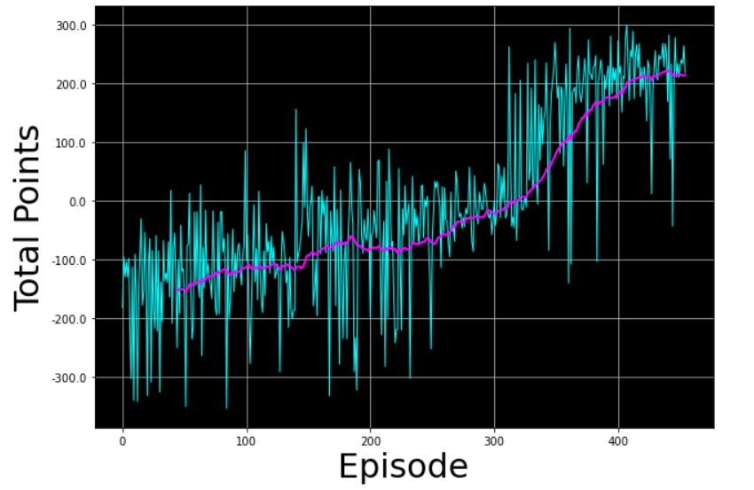

# LunarLander Agent – Reinforcement Learning 🚀

## 📌 Overview  
This project trains a reinforcement learning (RL) agent to **safely land a lunar lander** on a designated pad using OpenAI Gym’s **LunarLander-v2** environment.  
It demonstrates the application of **policy optimization techniques** and deep learning to solve challenging control problems in simulated space exploration.

---

## 🛠️ Tools & Technologies  
- Python  
- OpenAI Gym (LunarLander-v2 environment)  
- TensorFlow / Keras (neural network for policy learning)  
- NumPy, Matplotlib for evaluation and visualization  

---

## 🔍 Methodology  
1. **Environment Setup**  
   - Used OpenAI Gym’s LunarLander environment  
   - State space includes position, velocity, angle, and leg contact  
2. **Agent Architecture**  
   - Neural network with Dense layers  
   - Optimizer: Adam  
   - Loss: Mean Squared Error (MSE)  
3. **Training**  
   - Experience replay buffer with state-action-reward transitions  
   - Policy optimization through gradient updates  
   - Episode-based training with moving average performance tracking  
4. **Evaluation**  
   - Performance monitored via total rewards per episode  
   - Convergence determined when 100-episode moving average ≥ 200  

---

## 📊 Results & Insights  
- **Learning Progression:**  
  - Episode 100 → Avg: **-132.04**  
  - Episode 200 → Avg: **-89.68**  
  - Episode 300 → Avg: **-45.00**  
  - Episode 400 → Avg: **124.20**  
  - Episode 455 → Avg: **200.05** 🎉  
- **Environment solved in 455 episodes!**  
- **Total runtime:** ~525s (8.76 minutes)  
- Agent steadily improved from crashing consistently to achieving stable landings  

---

## 📈 Example Visuals  

Reward history with moving average:  



---

## 🚀 How to Run This Project  

```bash
# Clone the repository
git clone https://github.com/Josefxl/LunarLander_Agent.git
cd LunarLander_Agent

# Install dependencies
pip install gym tensorflow numpy matplotlib pillow

# Required Imports (Python)
import time
from collections import deque, namedtuple

import gym
import numpy as np
import PIL.Image
import tensorflow as tf
import utils

from pyvirtualdisplay import Display
from tensorflow.keras import Sequential
from tensorflow.keras.layers import Dense, Input
from tensorflow.keras.losses import MSE
from tensorflow.keras.optimizers import Adam

# Run training
python lunar_lander.py
